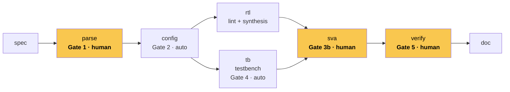
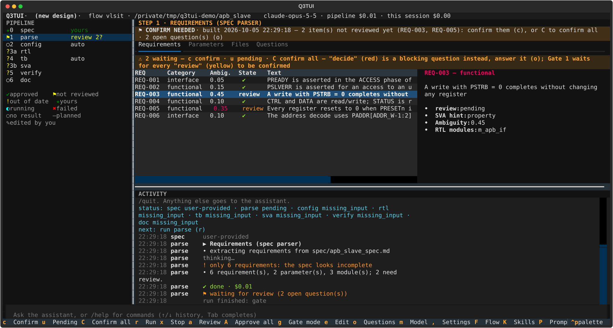
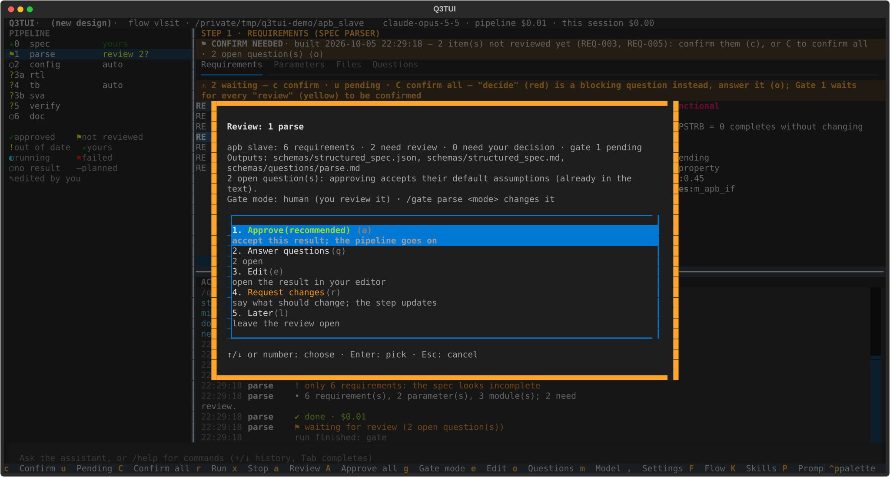
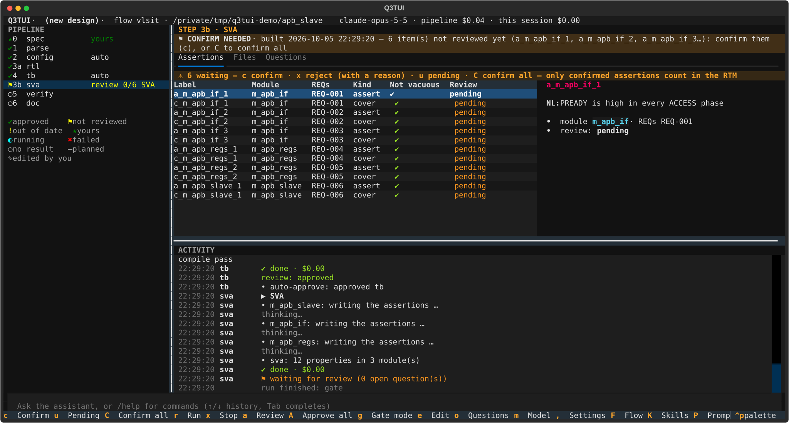
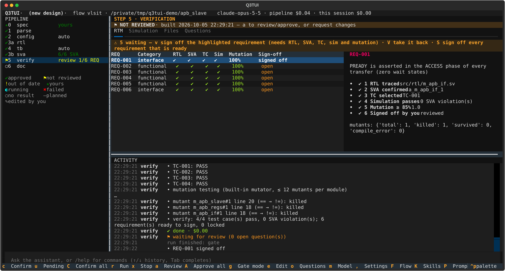

# Q3TUI

**Q3 = Quality · Quick · Quorum.** A terminal UI and CLI that takes a hardware IP block from intent to
verified, synthesizable RTL through a gated, agentic pipeline — built on the
[Claude Agent SDK](https://code.claude.com/docs/en/agent-sdk), with EDA tools (lint, synthesis, simulation)
behind pluggable, vendor-agnostic role adapters.

Product of **VLSI Technology**.

## Overview

Q3TUI runs the **VLSIT flow** end to end: `spec → parse (requirements) → config (parameters) → rtl ‖ tb →
sva (assertions) → verify (simulation + mutation + sign-off) → doc`. Every phase that needs a human decision
stops at a **gate**; everything else — naming-rule compliance, lint, requirement traceability, simulation,
mutation scoring — is checked deterministically by code, not trusted to the model's word. You can drive the
whole thing from the **TUI** (`q3tui`), the **CLI** (`q3tui run`, `q3tui status`, …), or by chatting with the
built-in assistant, which has a tool for every action a key or command has.

See the **[User guide](docs/user_guide/)** for how to install, run, and work the flow day to day (English and
Vietnamese), and `docs/spec/` for the underlying design and architecture reference.

## The flow



`rtl` and `tb` only need `config`'s output — run them one after another (default) or in parallel
(`pipeline.parallel_rtl_tb`). Yellow = a gate that stops for your review by default.

## The TUI



**Pipeline** (left): every step with its status icon, number and gate mode or what it is waiting for. **Step
view** (top right): the selected step's result in tabs — here the requirements `parse` extracted, two flagged
for your review, the highlighted one in detail. **Activity** (bottom right): the live log of the run.
**Command / chat bar**: a `/command`, or plain text to the assistant. The footer lists the keys of what has
focus.

<table>
<tr>
<td width="33%"><a href="docs/images/tui-gate.svg"></a></td>
<td width="33%"><a href="docs/images/tui-sva.svg"></a></td>
<td width="33%"><a href="docs/images/tui-verify.svg"></a></td>
</tr>
<tr>
<td><b>Review dialog</b> (<code>a</code>): approve, answer the open questions, edit, or request changes.</td>
<td><b>Gate 3b · assertions</b>: each SVA property with its requirement, plain-English meaning and vacuity check — confirm (<code>c</code>) or reject with a reason (<code>x</code>).</td>
<td><b>Gate 5 · sign-off</b>: the RTM — RTL, SVA, test case, simulation, mutation score per requirement; you sign off (<code>v</code>).</td>
</tr>
</table>

## Features

- **Gated pipeline, not a black box.** Three human review gates by default (requirements, assertions,
  verification sign-off); two self-sign when their checks pass (config, testbench). Every gate's mode
  (`human` / `auto` / `auto_answer` / `none`) is switchable per project or per session.
- **Updates, not re-runs.** Changing one requirement updates only the modules and tests it touches — the rest
  of the design, and your review approvals, stay as they were.
- **RTL rule enforcement, deterministically.** Naming conventions, prohibited constructs (delays, latches,
  signed types, testbench-only system tasks, …), file/module-name consistency and more are checked by a
  code-level linter against your project's rule file(s) — the LLM gets the same rules as text, but never has
  the final word on compliance.
- **Traceable by construction.** Every requirement is tagged in the RTL that implements it, covered by a test
  case, and asserted by SVA properties you personally confirm — a six-condition requirements traceability
  matrix (RTM) is what you sign off against, not a summary.
- **Review what needs reviewing, nothing more.** Assertions, flagged requirements and changed parameters each
  have their own pending-review tracking, separate from blocking questions — gates refuse to self-approve
  until you've actually looked, unless you turn that off deliberately (`auto_confirm_reviews`).
  Non-vacuous-only: an assertion that never fired in simulation is never silently "confirmed."
- **rtl ‖ tb in parallel**, optionally on fully separate LLM sessions, when your project has no reason to run
  them one after the other.
- **Chat like the rest of the team.** The in-TUI assistant can run steps, answer questions, change gate
  modes, adjust settings, review assertions, sign off requirements — anything a key or `/command` can do —
  and replies in whichever language you write to it in.
- **Language-aware chrome.** The TUI's own interface (status legend, result banners, dialogs) and the
  pipeline's generated content (spec, RTL comments, questions, docs) follow one `tui.language` setting
  (English / Vietnamese / Korean); the assistant conversation is the one exception, mirroring your own
  language instead.

See **[FEATURES.md](docs/FEATURES.md)** for the full feature inventory (pipeline engine, every step, gates and
review in depth, RTL rule enforcement, the TUI, the CLI, the assistant, settings, and known beta
limitations).

## Version history

| Version | Date | Status | Author(s) | Notes |
|---|---|---|---|---|
| 0.1.0 | 2026-10 | **Beta** | Ethanoctis, superdalink | VLSIT flow (spec → parse → config → rtl ‖ tb → sva → verify → doc) complete end to end; TUI, CLI and assistant parity. |

## Quick start

```bash
uv sync                                   # Python >= 3.11
mkdir -p ~/.q3tui && cp q3tui.example.yaml ~/.q3tui/q3tui.yaml   # EDA modules, default model

mkdir my_block && cd my_block
mkdir spec && echo "# My Block" > spec/my_block_spec.md   # or q3tui init for a template skeleton
q3tui                                     # opens the TUI — press r to run, a to review, o for questions
```

Full install options, the step-by-step flow, every setting and command: see the
**[User guide](docs/user_guide/)**.
