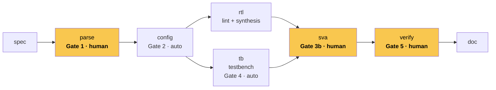
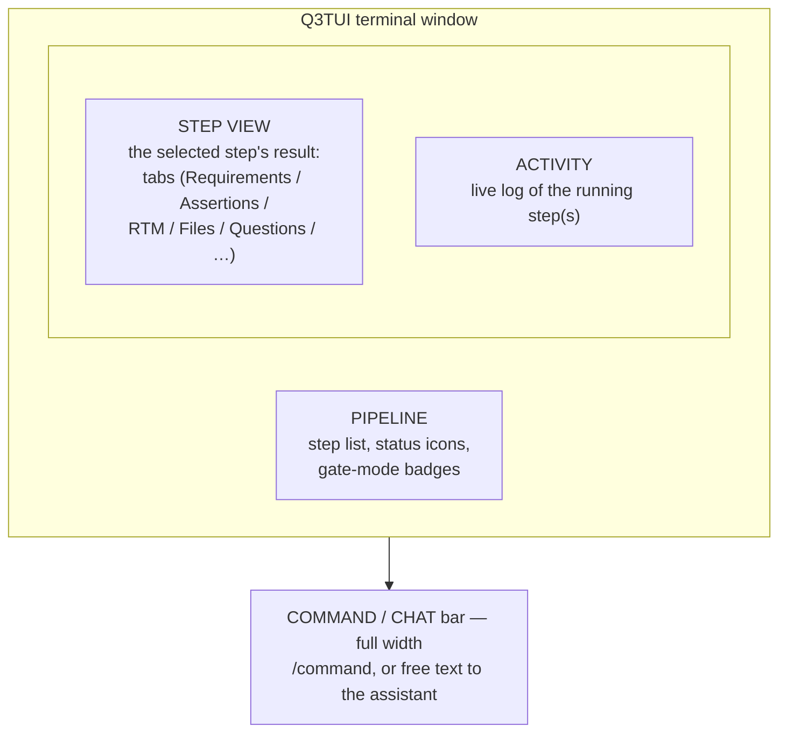

# Q3TUI Feature Inventory

This inventory reflects the current source as of **2026-10** (version 0.1.0, Beta) and focuses on the
**VLSIT flow** (`spec → parse → config → rtl ‖ tb → sva → verify → doc`), the flow this product ships with
by default. See the [User guide](user_guide/) for how to use everything listed here, and [spec/](spec/) for
the architecture reference.

## 1. Pipeline engine

- **Content-hash staleness.** Every step snapshots what it was built from; a later run re-checks the hash
  and skips the LLM entirely when nothing relevant changed.
- **Update, not re-run.** A changed requirement, parameter or a change request you queue updates only the
  steps it actually touches — unaffected steps and your existing gate approvals stay as they were.
- **Run any range.** `q3tui run [from] [to]`, or `only=<step>` — resume after a crash, re-run one step, or
  drive the whole pipeline in one call.
- **One run at a time, watchable from elsewhere.** A lock file means a second process (e.g. the TUI while
  the CLI is mid-run) only watches, never double-runs.
- **Reset with a plan.** `q3tui reset <step>` shows exactly which generated files would be deleted (and
  backs them up) before you confirm; your own hand-written files are never touched.

## 2. The VLSIT flow

| Step | What it does | Gate |
|---|---|---|
| spec | Drafts (or accepts your) IP specification, section by section, from an intent or as-is. | human |
| parse | Extracts requirements (REQ-IDs), parameters and the module map; flags ambiguity. | **1 · human** |
| config | Resolves parameter values against your change requests; checks elaboration constraints. | 2 · auto |
| rtl | Writes one synthesizable SystemVerilog module per plan entry; lints and synthesizes it. | — |
| tb | Writes a plain-SystemVerilog testbench and test plan; compiles it. | 4 · auto |
| sva | Writes SVA properties per requirement, binds them to the RTL, runs a vacuity smoke pass. | **3b · human** |
| verify | Simulates every selected test, mutation-tests the RTL, builds the RTM. | **5 · human** |
| doc | Assembles the specification document (Markdown + PDF) from the other steps' artifacts. | — |



- **rtl ‖ tb in parallel.** Both steps read only `spec`/`parse`/`config` — neither needs the other's output
  — so they can run concurrently (`pipeline.parallel_rtl_tb`) instead of one after the other.
- **Separate agent sessions, optionally.** `pipeline.parallel_multi_agent` gives `tb` its own persistent LLM
  session (role `verifier`) instead of queuing behind `rtl`'s on the flow's one shared session, so the LLM
  calls themselves run concurrently too, not just the tool runs.

## 3. Gates and review

- **Four gate modes** per step: `human` (always stops), `auto` (self-signs once no blocking question is
  open), `auto_answer` (unattended — also answers every question with its default), `none`.
- **Two independent things a gate can wait on:** a *blocking question* (an actual decision only a human can
  make) and *unconfirmed review items* (SVA assertions, flagged requirements, changed parameters). A `human`
  gate's plain `Approve` refuses while either is open; an `auto`/`auto_answer` gate only cares about blocking
  questions — unconfirmed items simply don't count toward the requirements traceability matrix.
- **Per-item review, not a rubber stamp.** `c`/`u`/`C` (confirm / back to pending / confirm all) for SVA
  assertions, flagged requirements and changed parameters; `x` to reject an assertion with a reason, routed
  back to `sva` as a scoped change request for that module only.
- **Vacuous assertions are never silently confirmed.** A confirm-all explicitly skips any assertion whose
  trigger condition never fired during the simulation smoke pass — those need your explicit `c`.
- **Dedicated opt-out.** `pipeline.auto_confirm_reviews` turns off the per-item review requirement
  specifically, independent of the broader auto-approve/auto-answer switches — gates still stop for the
  things that actually matter.

## 4. Requirements traceability and sign-off

- **Six-condition RTM.** Every requirement's row tracks: (1) tagged in RTL, (2) an SVA assertion you
  confirmed, (3) covered by a selected test case, (4) that simulation passes, (5) mutation score ≥ threshold
  (or `N/A`), (6) signed off by you. `sign_req`/`sign_all` never auto-sign — a human decision, always.
  `S` bulk-signs everything that's already ready, skipping the rest without error.
- **Mutation testing** (built-in mutator, or a configured `mutate` tool role) scores whether the test suite
  would actually catch a functional bug, per requirement — not just whether tests pass.
- **Doc generation.** `doc` assembles a specification document (Markdown + PDF) referencing the final
  parameters, RTL, and the RTM, from the other steps' artifacts — not hand-maintained.

## 5. RTL coding rule enforcement

- **Rule files as the single source of truth**, read by the RTL stage's own prompt *and* checked
  deterministically by code — naming prefixes (ports, registers, instances, modules, parameters), file/
  module-name consistency, name length, and a list of prohibited constructs (delays, latches, `casex`,
  `defparam`, signed types/literals, two-state types, testbench-only system tasks such as `$display`/
  `$finish`/`$random` — with `$error` allowed only as the sanctioned elaboration-time parameter-validation
  exception — and more).
- **Project-overridable.** A default baseline ships with the flow; a project can add its own rule file
  (`pipeline.step_options.rtl.rules`) on top, or override the default outright with a same-named file.
- **The LLM never has the final word.** Every RTL-writing stage can call a `check` tool mid-turn and
  self-correct before finishing; what actually ships still goes through the same deterministic check.

## 6. Terminal UI (TUI)



```text
┌─ Q3TUI · my_block · ~/proj/my_block ───────────────────────── claude-opus-5-5 · $0.42 ─┐
│ PIPELINE            │ STEP parse · REQUIREMENTS   [Requirements] [Parameters] [Questions]│
│                     │ ⚑ CONFIRM NEEDED — 2 item(s) not reviewed (REQ-004, REQ-007)        │
│ ✔ spec              │ REQ-001  functional   0.12   ✔                                     │
│ ⚑ parse             │ REQ-004  interface     0.41   review                                │
│ · config            ├───────────────────────────────────────────────────────────────────┤
│ · rtl                │ ACTIVITY — parse                                                   │
│ · tb                 │ 14:02:11 parse   extracting requirements from spec/my_block_spec.md│
│ · sva                │ 14:02:40 parse   12 requirement(s), 3 parameter(s); 2 need review   │
│ · verify             │                                                                     │
│ · doc                │                                                                     │
├─────────────────────┴───────────────────────────────────────────────────────────────────┤
│ > confirm REQ-004 and REQ-007, they look fine                                           │
├─────────────────────────────────────────────────────────────────────────────────────────┤
│ r run · x stop · a review · c confirm · o questions · i chat · ? help                   │
└─────────────────────────────────────────────────────────────────────────────────────────┘
```

- **One engine, two front ends.** Anything the TUI does, the CLI can too, and the other way round; a TUI
  started while another process is running only watches (never double-runs).
- **Result banners that say what's actually needed**, not a generic "not reviewed": a specific blocking
  question prompt, a specific list of unconfirmed items, or the plain approve prompt — whichever applies.
- **Resizable, rememberable layout.** Drag the pane dividers or `ctrl+arrows`; sizes are kept per project.
- **Three-language chrome.** `tui.language` (`en`/`vi`/`ko`) switches the TUI's own interface and the
  pipeline's generated content together; the assistant conversation is the one exception, mirroring
  whichever language you write to it in instead.
- **Icon sets for any terminal font:** `unicode`, `nerd` (Nerd Font glyphs), `ascii`.

## 7. CLI

- `q3tui` (no args) opens the TUI; `q3tui run/status/approve/answer/change/reset/...` drive the same engine
  headlessly — scriptable, CI-friendly.
- `q3tui init [--template]` scaffolds a new project (`spec/intent.md`, optionally an editable section
  template).
- `q3tui design parse|check` — RTL utilities with no LLM involved, for a quick lint/structure check.
- `q3tui flow list/show` — inspect which steps a flow runs, in what order, with which gates.

## 8. The assistant (chat)

- **A tool for every action** a key or `/command` has: run steps, answer questions, change gate modes,
  review assertions, sign off requirements, adjust any setting, edit spec sections, import files, and more.
- **Confirms before anything destructive** (reset, turning on an unattended mode) — it never does those
  silently.
- **Replies in your language**, independent of `tui.language` — it mirrors whatever language you write to
  it in, every time.

## 9. Settings

- One registry (`q3tui/core/settings.py`) backs the Settings dialog (`,`), the CLI/assistant's
  `get_settings`/`set_settings`, and `q3tui.yaml` — change something once, it's consistent everywhere.
- Every change can be session-only or saved to `q3tui.yaml` (`--save`, or the dialog's checkbox).
- See the [User guide](user_guide/) §6 for the full table of every setting across every tab.

## 10. Known limitations (beta)

- UI-chrome translation (`tui.language`) covers the legend, result banners, and the Questions/Picker
  dialogs; the full keybinding help text and some dialog screens (Settings, Flow/Skill/Prompt editors,
  Stats) are still English-only.
- `Binding` key-labels and `DataTable` column headers are set once when a widget first mounts — switching
  `tui.language` mid-session updates visible text immediately, but those two specifically need the tab/
  dialog reopened (or the TUI restarted) to pick up the new language.
- Deterministic RTL-rule checking covers naming, length, and the prohibited-construct list; a few rules
  from the text (e.g. the abbreviation table, combinational-loop freedom) are LLM-followed guidance only,
  not yet independently verified by code.
